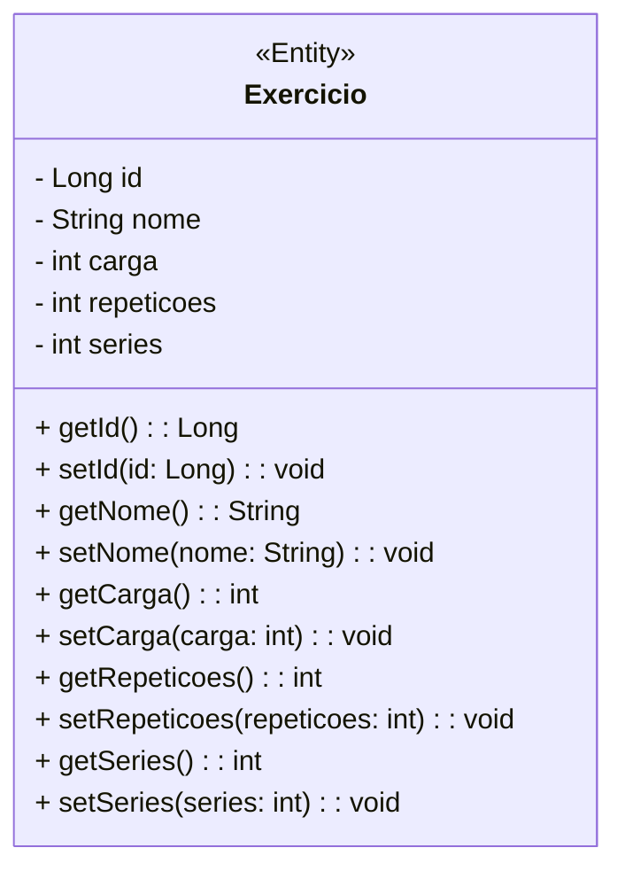
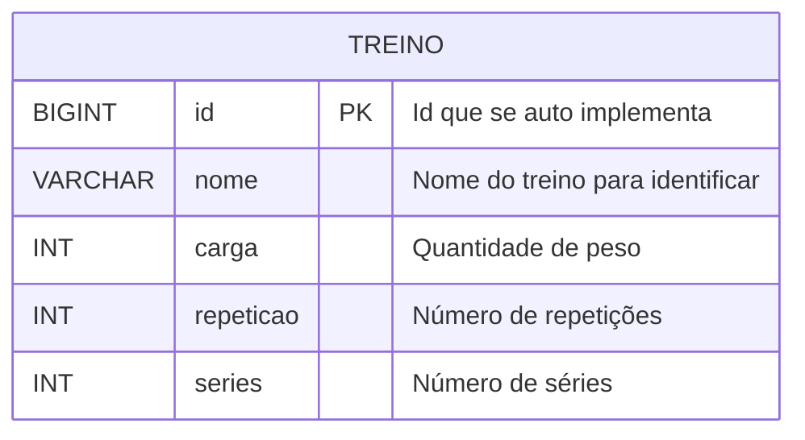

<div align="center">

# GymBro - Backend


</div>
<br />

<div align="center">
    
</div>

---

## Descrição

Gymbro é um aplicativo de fitness personalizado focado na organização e no acompanhamento de rotinas de treino de musculação.

---

## Sobre esta API

A API do **Gymbro** é o núcleo da aplicação de fitness personalizada. Seu objetivo é oferecer uma solução digital focada na **organização e acompanhamento de rotinas de treino de musculação**, adaptadas às necessidades individuais dos usuários. Embora a proposta inicial tenha como foco principal a organização semanal dos treinos, a API foi estruturada para permitir fácil expansão e personalização.

### Principais Funcionalidades

- 📌 **Cadastro e gerenciamento de treinos**  
  Permite criar, editar, listar e excluir treinos personalizados.

- 🏋️ **Definição de carga, repetições e séries**  
  Armazena informações detalhadas sobre cada exercício de treino.

- 📅 **Organização semanal dos treinos**  
  Os treinos podem ser organizados por dias da semana, facilitando a rotina do usuário.

- 👤 **Gerenciamento de usuários (opcional)**  
  Permite associar treinos a usuários específicos (caso a funcionalidade esteja implementada).

- 🔗 **API RESTful com boas práticas de arquitetura**  
  Endpoints bem definidos, com suporte a operações CRUD (Create, Read, Update, Delete).

- 🚀 **Base para futuras melhorias**  
  Estrutura preparada para expansão com autenticação, dashboards e recomendações inteligentes.

---

## Diagrama de Classes



---

## Diagrama Entidade-Relacionamento (DER)



---

## API Endpoints

A API fornece os seguintes endpoints:

**GET EXERCICIOS**

```markdown
GET /exercicio - Recuperar uma lista de todos exercicios.
```

```json
[
  {
    "id": 1,
    "nome": "Treino Ombro",
    "carga": 20,
    "repeticoes": 12,
    "series": 3
  },
  {
    "id": 3,
    "nome": "Treino teste",
    "carga": 20,
    "repeticoes": 15,
    "series": 3
  }
]
```

**POST EXERCICIOS**

```markdown
POST /exercicio - Registra um novo exercício no aplicativo
```

```json
{
  "nome": "Treino Braço e perna",
  "carga": 20,
  "repeticoes": 12,
  "series": 3
}
```

**UPDATE EXERCICIOS**

```markdown
PUT /exercicio - Atualiza um exercicio existente
```

```json
{
  "id": 32,
  "nome": "Treino teste",
  "carga": 20,
  "repeticoes": 15,
  "series": 3
}
```

---

## Tecnologias utilizadas

| Item                          | Descrição        |
| ----------------------------- | ---------------- |
| **Servidor**                  | Tomcat           |
| **Linguagem de programação**  | Java             |
| **Framework**                 | Spring Framework |
| **ORM**                       | Hibernate        |
| **Banco de dados Relacional** | MySQL            |

---

## Configuração e Execução

1. Clone o repositório:
   ```bash
   git clone https://github.com/seu-usuario/gymbro-backend.git
   ```
2. Acesse a pasta do projeto:
   ```bash
   cd gymbro-backend
   ```
3. Configure o banco de dados:
   - Edite o arquivo application.properties ou application.yml na pasta src/main/resources
   - Defina as configurações do banco de dados (URL, usuário, senha)
4. Compile o projeto com Maven ou Gradle:

   Maven:

   ```bash
   mvn clean install
   ```

5. Execute a aplicação::
   Maven:
   ```bash
   mvn spring-boot:run
   ```
6. Acesse a API em:

   ```bash
   http://localhost:8080
   ```

7. Use ferramentas como Insomnia ou Postman para testar os endpoints.

## Contribuições

Contribuições são sempre bem-vindas! Se você encontrar algum problema ou tiver sugestões para melhorias, por favor, abra uma issue ou envie um pull request para o repositório.

Ao contribuir, siga o estilo de código já existente e as convenções de commits. Por favor, envie suas alterações em uma branch separada.
